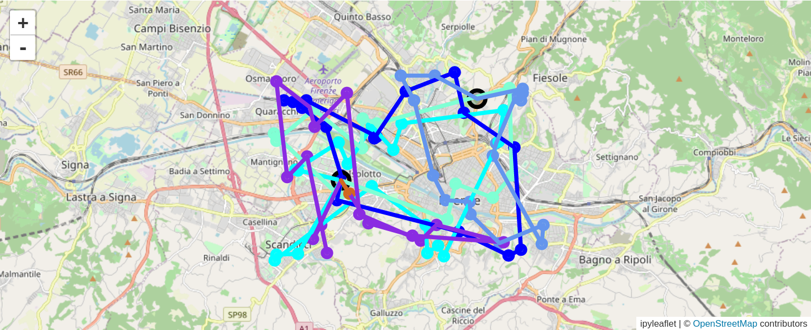
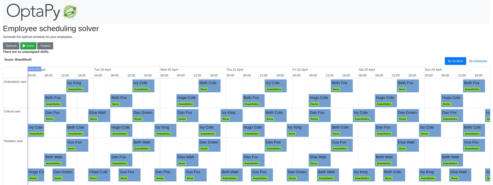

= OptaPy Quickstarts

== Overview of all Quickstarts

|===
|Quickstart | Binder Link

a|* <<school-timetabling, School timetabling>>
* <<vehicle-routing, Vehicle routing>>
* <<employee-scheduling, Employee scheduling>>

a|* https://mybinder.org/v2/gh/optapy/optapy-quickstarts/stable?filepath=school-timetabling/school-timetabling-quickstart.ipynb[image:https://mybinder.org/badge_logo.svg[Binder]]
* https://mybinder.org/v2/gh/optapy/optapy-quickstarts/stable?filepath=vehicle-routing/vehicle-routing-quickstart.ipynb[image:https://mybinder.org/badge_logo.svg[Binder]]
* Not Available
|===

== Get started

Click the binder link to open the quickstart's notebook and run it in your browser.

== Quickstarts

[[school-timetabling]]
=== School timetabling

https://mybinder.org/v2/gh/optapy/optapy-quickstarts/stable?filepath=school-timetabling/school-timetabling-quickstart.ipynb[image:https://mybinder.org/badge_logo.svg[Binder]]

Assign lessons to timeslots and rooms to produce a better schedule for teachers and students.

image::images/school-timetabling-screenshot.png[]

* link:school-timetabling/README.adoc[Run the school timetabling quickstart locally]

[[vehicle-routing]]
=== Vehicle routing

https://mybinder.org/v2/gh/optapy/optapy-quickstarts/stable?filepath=vehicle-routing/vehicle-routing-quickstart.ipynb[image:https://mybinder.org/badge_logo.svg[Binder]]

Find the most efficient routes for a fleet of vehicles.

* link:school-timetabling/README.adoc[Run the vehicle routing quickstart locally]

[[employee-scheduling]]
=== Employee scheduling

Assign employees to shifts to improve shifts schedule.

* link:employee-scheduling/README.adoc[Run the employee scheduling quickstart locally]

== More information

Learn more on https://www.optapy.org[www.optapy.org].