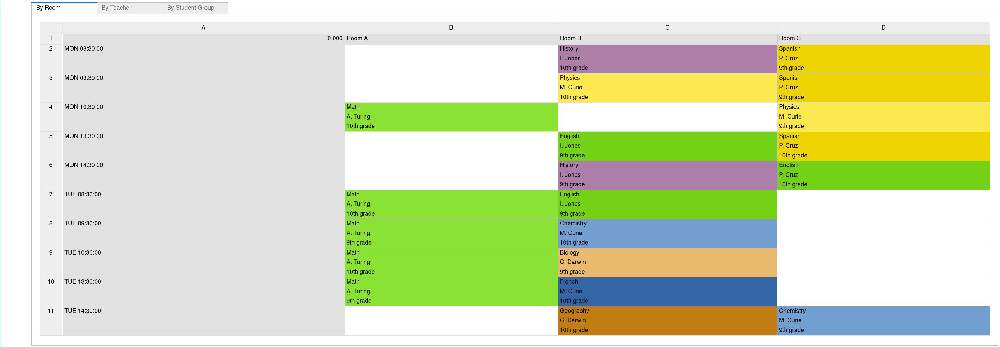

= School timetabling

https://mybinder.org/v2/gh/optapy/optapy-quickstarts/stable?filepath=school-timetabling/school-timetabling-quickstart.ipynb[image:https://mybinder.org/badge_logo.svg[Binder]]

Assign lessons to timeslots and rooms to produce a better schedule for teachers and students.

* <<requirements,Requirements>>
* <<run,Run the application>>
* <<test,Test the application>>

[[requirements]]
== Requirements

* https://www.python.org[Install Python 3.9 or later.]
* https://adoptopenjdk.net[Install JDK 11 or later] with the environment variable `JAVA_HOME` configured to the JDK installation directory.

[[run]]
== Run the application

. Git clone the optapy-quickstarts repo and navigate to this directory:
+
[source, shell]
----
$ git clone https://github.com/optapy/optapy-quickstarts.git
$ cd optapy-quickstarts/school-timetabling
----

. Activate a virtual environment
+
[source, shell]
----
$ python -m venv venv
$ . venv/bin/activate
----

. Install the quickstart requirements to the virtual environment
+
[source, shell]
----
$ pip install -r requirements.txt
----

. Run the application
+
[source, shell]
----
$ python main.py
----

OptaPy will begin solving the schedule and print it when finished:

[source,text]
----
|------------|------------|------------|------------|
|            | Room A     | Room B     | Room C     |
|------------|------------|------------|------------|
| MON 08:30: |            | Math       | History    |
|            |            | A. Turing  | I. Jones   |
|            |            | 9th grade  | 10th grade |
|------------|------------|------------|------------|
| MON 09:30: |            | Math       | History    |
|            |            | A. Turing  | I. Jones   |
|            |            | 10th grade | 9th grade  |
|------------|------------|------------|------------|
| MON 10:30: |            | Math       | English    |
|            |            | A. Turing  | I. Jones   |
|            |            | 10th grade | 9th grade  |
|------------|------------|------------|------------|
| MON 13:30: | Math       | Spanish    |            |
|            | A. Turing  | P. Cruz    |            |
|            | 10th grade | 9th grade  |            |
|------------|------------|------------|------------|
| MON 14:30: | Math       | English    |            |
|            | A. Turing  | P. Cruz    |            |
|            | 9th grade  | 10th grade |            |
|------------|------------|------------|------------|
| TUE 08:30: | Physics    | Spanish    |            |
|            | M. Curie   | P. Cruz    |            |
|            | 9th grade  | 10th grade |            |
|------------|------------|------------|------------|
| TUE 09:30: | Chemistry  |            | English    |
|            | M. Curie   |            | I. Jones   |
|            | 10th grade |            | 9th grade  |
|------------|------------|------------|------------|
| TUE 10:30: | Physics    | Spanish    |            |
|            | M. Curie   | P. Cruz    |            |
|            | 10th grade | 9th grade  |            |
|------------|------------|------------|------------|
| TUE 13:30: | French     |            | Biology    |
|            | M. Curie   |            | C. Darwin  |
|            | 10th grade |            | 9th grade  |
|------------|------------|------------|------------|
| TUE 14:30: | Chemistry  | Geography  |            |
|            | M. Curie   | C. Darwin  |            |
|            | 9th grade  | 10th grade |            |
|------------|------------|------------|------------|

----

[[test]]
== Run the tests

. Git clone the optapy-quickstarts repo and navigate to this directory:
+
[source, shell]
----
$ git clone https://github.com/optapy/optapy-quickstarts.git
$ cd optapy-quickstarts/school-timetabling
----

. Activate a virtual environment
+
[source, shell]
----
$ python -m venv venv
$ . venv/bin/activate
----

. Install the quickstart requirements and a testing framework to the virtual environment
+
[source, shell]
----
$ pip install -r requirements.txt pytest
----

. Run the tests
+
[source, shell]
----
$ python -m pytest tests.py
----

== More information

Visit https://www.optapy.org/[www.optapy.org].